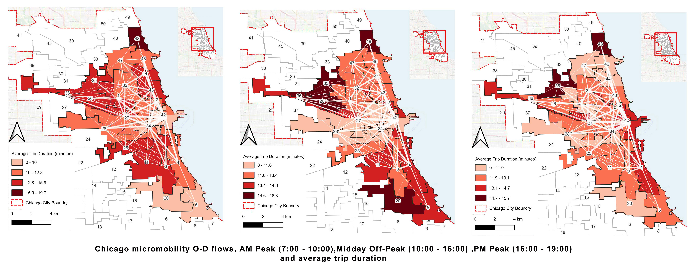

# Micromobility-Analysis-Transport2025
Conducted micromobility analysis for Austin and Chicago using Pandas for data processing and QGIS for spatial visualization.
### Next step: Interactive Map
### Data: 
[micro-mobility data for Austin](https://data.austintexas.gov/Transportation-and-Mobility/Shared-Micromobility-Vehicle-Trips-2018-2022-/7d8e-dm7r/about_data) 
[micro-mobility data from Chicago](https://data.cityofchicago.org/Transportation/Divvy-Trips/fg6s-gzvg/about_data) 
### Overlapping visualization with OD matrices and average parking durations:

